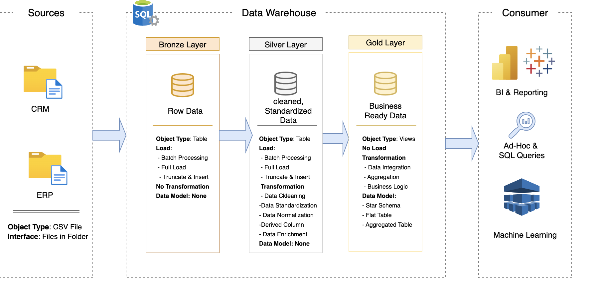

# Data Warehouse and Analytics Project

Welcome to my **Data Warehouse and Analytics Project**! 🚀  
This project is a complete end-to-end data warehousing and analytics solution — from building the data warehouse to generating meaningful insights. It was built as part of my learning journey to practice **data engineering and analytics best practices**.

---

## 🏗️ Data Architecture

This project uses the **Medallion Architecture** with three layers:

1. **Bronze Layer** – Raw data ingested from CSV files into SQL Server.  
2. **Silver Layer** – Cleaned, standardized, and transformed data for consistency.  
3. **Gold Layer** – Business-ready data modeled in a **Star Schema** for analytics and reporting.  

Here’s the data architecture I designed:



---

## 📖 Project Overview

The project includes:

- **Data Architecture** – Designing a warehouse using the Bronze, Silver, and Gold structure.  
- **ETL Pipelines** – Extracting, transforming, and loading data from source systems.  
- **Data Modeling** – Creating fact and dimension tables optimized for analytics.  
- **Analytics & Reporting** – Writing SQL queries and building dashboards to generate insights.  

This project helped me practice skills in:  
- SQL Development  
- Data Engineering  
- ETL Pipeline Design  
- Data Modeling  
- Data Analytics  

---

## 🛠️ Tools & Resources

- **Datasets** (CSV files)  
- **SQL Server Express** – For hosting the database  
- **SQL Server Management Studio (SSMS)** – For interacting with the database  
- **DrawIO** – For designing architecture diagrams  
- **Git & GitHub** – For version control and collaboration  

---

## 🚀 Project Requirements

### Data Warehouse (Engineering Side)

**Goal:** Build a warehouse that consolidates data from multiple sources to support reporting and decision-making.  

- **Sources**: ERP and CRM datasets (CSV)  
- **Data Cleaning**: Handle missing, duplicate, and inconsistent records  
- **Integration**: Combine both sources into one unified model  
- **Scope**: Focus on the most recent dataset (no historization needed)  
- **Documentation**: Provide clear descriptions of the data model  

---

### Analytics & Reporting (Analysis Side)

**Goal:** Deliver insights using SQL-based analytics, covering:  

- Customer behavior  
- Product performance  
- Sales trends  

---

## 📂 Repository Structure
```
data-warehouse-project/
│
├── datasets/ # ERP and CRM CSV datasets
├── docs/ # Architecture diagrams, data catalog, and documentation
├── scripts/ # SQL scripts (Bronze, Silver, Gold layers)
├── tests/ # Data quality and test scripts
├── README.md # Project overview (this file)
└── LICENSE # License file
```
## 🛡️ License

This project is licensed under the [MIT License](LICENSE).  
You are free to use, modify, and share it with attribution.

---

## 🌟 About Me

Hi! I’m Hadis a **data engineering and analytics**.  
This project helped me practice real-world concepts like data pipelines, modeling, and analytics reporting.  

